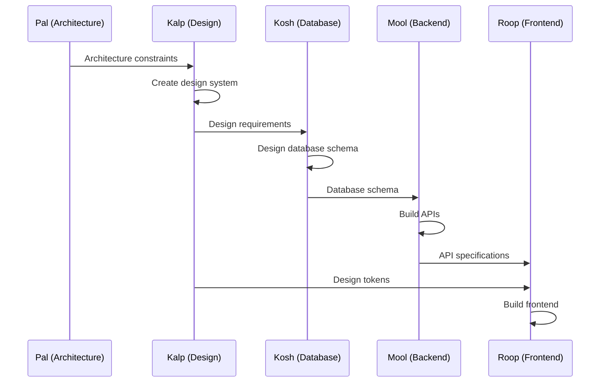
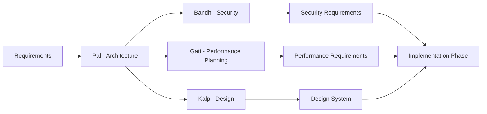
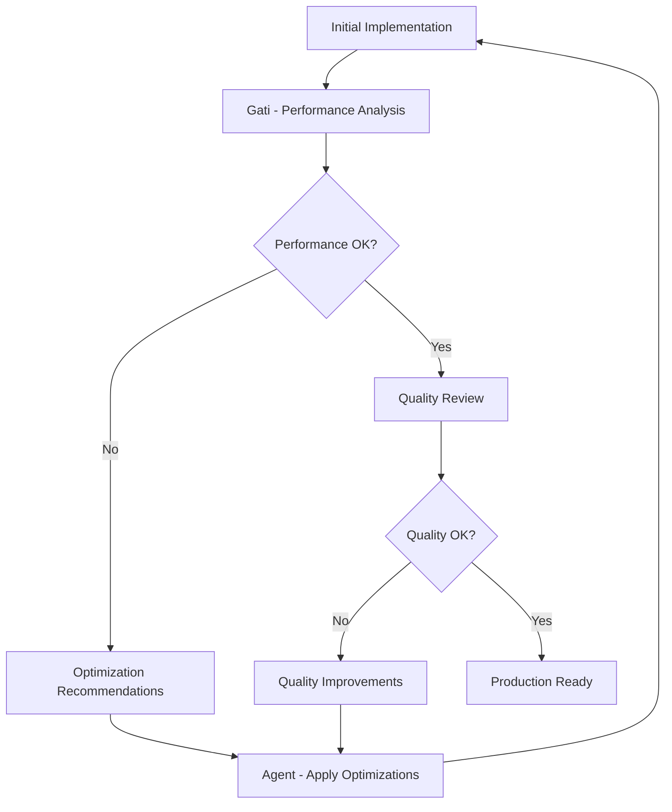

# Dhrit Platform - Project Coordination Guide

This guide explains how the 8 AI agents coordinate to build complete applications, including communication patterns, dependency management, and quality gates.

## 🔄 Agent Coordination Architecture

### Agent Network Overview
```
┌─────────────────────────────────────────────────────────────────┐
│                    Dhrit Agent Network                          │
├─────────────────────────────────────────────────────────────────┤
│  Pal (Architecture) ←→ All Agents (Oversight & Conflict Res.)  │
│  Kalp (Design) ←→ Roop, Mool (Design Distribution)             │
│  Bandh (Security) ←→ All Agents (Security Reviews)             │
│  Kosh (Database) ←→ Mool (Schema Handoff)                      │
│  Mool (Backend) ←→ Roop (API Integration)                      │
│  Roop (Frontend) ←→ Gati (Performance Feedback)                │
│  Gati (Performance) ←→ All Agents (Optimization)               │
│  Dhar (QA/DevOps) ←→ All Agents (Testing & Deployment)        │
└─────────────────────────────────────────────────────────────────┘
```

## 🎯 Coordination Patterns

### 1. Sequential Handoff Pattern
**Used for**: Dependencies where one agent must complete before another starts



**Implementation:**
```bash
# Step 1: Architecture
pal --projectId "app" --task "Design architecture" --requirements "..."

# Step 2: Design System
kalp --projectId "app" --task "Create design system" --requirements "..."

# Step 3: Database (depends on architecture + design)
kosh --projectId "app" --task "Design database" --requirements "..."

# Step 4: Backend (depends on database)
mool --projectId "app" --task "Build APIs" --requirements "..."

# Step 5: Frontend (depends on design + APIs)
roop --projectId "app" --task "Build interface" --requirements "..."
```

### 2. Parallel Coordination Pattern
**Used for**: Independent work that needs synchronization points



**Implementation:**
```bash
# Parallel execution after architecture
pal --projectId "app" --task "Design architecture" --requirements "..."

# These can run in parallel
bandh --projectId "app" --task "Security planning" --requirements "..." &
gati --projectId "app" --task "Performance planning" --requirements "..." &
kalp --projectId "app" --task "Design system" --requirements "..." &

# Wait for all to complete before proceeding
wait
```

### 3. Feedback Loop Pattern
**Used for**: Iterative improvement and optimization



**Implementation:**
```bash
# Initial implementation
roop --projectId "app" --task "Build interface" --requirements "..."

# Performance review and feedback
request --fromAgent "gati" --toAgent "roop" --projectId "app" --requestType "performance_review" --message "Review frontend performance and provide optimization recommendations"

# Roop implements optimizations
respond --requestId "req_123" --fromAgent "roop" --response "Implemented lazy loading, code splitting, and image optimization" --status "completed"

# Iterate until performance targets met
```

## 📨 Agent Communication System

### Request/Response Protocol

#### Request Structure
```json
{
  "requestId": "req_1735767123_abc123",
  "fromAgent": "roop",
  "toAgent": "mool",
  "projectId": "my-app",
  "requestType": "types",
  "message": "I need TypeScript interfaces for User and Task entities",
  "priority": "high",
  "status": "pending",
  "createdAt": "2025-01-01T12:00:00Z"
}
```

#### Response Structure
```json
{
  "requestId": "req_1735767123_abc123",
  "response": "TypeScript interfaces provided: interface User { id: string; name: string; email: string; }",
  "status": "completed",
  "respondedAt": "2025-01-01T12:05:00Z",
  "attachments": {
    "types": "user.types.ts",
    "documentation": "api-docs.md"
  }
}
```

### Communication Commands

#### Sending Requests
```bash
request --fromAgent "[sender]" --toAgent "[receiver]" --projectId "[project]" --requestType "[type]" --message "[message]" --priority "[priority]"
```

**Request Types:**
- `types` - TypeScript interfaces and type definitions
- `review` - Code, design, or architecture review
- `approval` - Security, performance, or quality approval
- `feedback` - Optimization or improvement suggestions
- `changes` - Modification requests
- `integration` - API or component integration help
- `documentation` - Documentation requests

#### Responding to Requests
```bash
respond --requestId "[id]" --fromAgent "[responder]" --response "[message]" --status "[status]"
```

**Response Statuses:**
- `approved` - Request approved, work can proceed
- `completed` - Work completed successfully
- `needs_changes` - Changes required before approval
- `rejected` - Request rejected with reasons
- `in_progress` - Work is ongoing
- `blocked` - Cannot proceed due to dependencies

## 🛡️ Quality Gates

### Security Gates (Bandh)
**Triggers:**
- Database schema design
- API endpoint creation
- Authentication implementation
- Data handling procedures

**Process:**
```bash
# Automatic security review trigger
kosh --projectId "app" --task "Design database schema" --requirements "..."
# → Automatically triggers security review

# Manual security review request
request --fromAgent "kosh" --toAgent "bandh" --projectId "app" --requestType "security_review" --message "Database schema ready for security audit"

# Bandh reviews and responds
respond --requestId "req_456" --fromAgent "bandh" --response "Schema approved with encryption requirements for PII fields" --status "needs_changes"
```

### Performance Gates (Gati)
**Triggers:**
- Frontend component completion
- Backend API implementation
- Database query design
- Deployment preparation

**Process:**
```bash
# Performance review after implementation
roop --projectId "app" --task "Build components" --requirements "..."
# → Triggers performance analysis

# Gati provides optimization feedback
request --fromAgent "gati" --toAgent "roop" --projectId "app" --requestType "performance_optimization" --message "Component bundle size exceeds 50KB, implement code splitting"

# Iterative optimization
respond --requestId "req_789" --fromAgent "roop" --response "Bundle optimized to 15KB with lazy loading" --status "completed"
```

### Quality Gates (Dhar)
**Triggers:**
- All agent outputs completion
- Pre-deployment checks
- Integration testing needs
- Production readiness assessment

**Process:**
```bash
# Comprehensive quality review
dhar --projectId "app" --task "Quality assessment" --requirements "Review all agent outputs for production readiness"

# Quality issues found
request --fromAgent "dhar" --toAgent "mool" --projectId "app" --requestType "quality_issues" --message "API endpoints missing error handling and rate limiting"

# Issues resolved
respond --requestId "req_101" --fromAgent "mool" --response "Added comprehensive error handling and rate limiting to all endpoints" --status "completed"
```

## 🔧 Dependency Management

### Agent Dependencies
```
Pal (Architecture)
├── No dependencies (starts first)
└── Provides constraints to all agents

Kalp (Design System)
├── Depends on: Pal (architecture constraints)
└── Provides to: Roop, Mool (design tokens)

Bandh (Security)
├── Depends on: Pal (architecture)
└── Reviews: All agent outputs

Kosh (Database)
├── Depends on: Pal (architecture), Kalp (data requirements)
└── Provides to: Mool (schema)

Mool (Backend)
├── Depends on: Kosh (database), Bandh (security approval)
└── Provides to: Roop (APIs)

Roop (Frontend)
├── Depends on: Kalp (design), Mool (APIs)
└── Provides to: Gati (performance target)

Gati (Performance)
├── Depends on: All implementations
└── Provides to: All agents (optimization feedback)

Dhar (QA/DevOps)
├── Depends on: All agent outputs
└── Provides: Deployment and monitoring
```

### Dependency Resolution
```bash
# Check project dependencies
status --projectId "app"

# Expected output shows dependency chain
# Pal: completed → Kalp: ready
# Kalp: completed → Kosh: ready, Roop: waiting for Mool
# Kosh: completed → Mool: ready
# etc.
```

## 🚨 Conflict Resolution

### Conflict Types and Resolution

#### 1. Technical Conflicts
**Example:** Kalp's design requires features not supported by Mool's API design

**Resolution Process:**
```bash
# Escalate to architecture
request --fromAgent "kalp" --toAgent "pal" --projectId "app" --requestType "conflict_resolution" --message "Design requires real-time features but current API architecture doesn't support WebSockets"

# Pal makes architectural decision
respond --requestId "req_conflict" --fromAgent "pal" --response "Architecture updated to include WebSocket support via Socket.io integration" --status "approved"

# Affected agents implement changes
mool --projectId "app" --task "Add WebSocket support" --requirements "Implement Socket.io for real-time features as per updated architecture"
```

#### 2. Security vs Performance Conflicts
**Example:** Gati's optimizations conflict with Bandh's security requirements

**Resolution Process:**
```bash
# Security blocks performance optimization
request --fromAgent "gati" --toAgent "bandh" --projectId "app" --requestType "security_exception" --message "Caching user data improves performance by 40% but may have security implications"

# Bandh provides secure alternative
respond --requestId "req_security" --fromAgent "bandh" --response "Approved with encrypted caching and 5-minute TTL" --status "approved"
```

#### 3. Quality vs Timeline Conflicts
**Example:** Dhar finds quality issues but timeline is tight

**Resolution Process:**
```bash
# Quality gate blocks deployment
request --fromAgent "dhar" --toAgent "pal" --projectId "app" --requestType "quality_gate" --message "Found 15 critical issues, need 2 days to fix but deployment scheduled for tomorrow"

# Architecture decision on priorities
respond --requestId "req_quality" --fromAgent "pal" --response "Fix 5 critical security issues immediately, defer others to post-launch" --status "approved"
```

## 📊 Coordination Monitoring

### Project Status Tracking
```bash
# Overall project status
status --projectId "app"

# Agent-specific status
status --projectId "app" --agent "roop"

# Coordination status
ls dhrit/projects/app/coordination/requests/
```

### Performance Metrics
- **Agent response time**: Time from request to response
- **Handoff efficiency**: Time between agent completions
- **Quality gate success rate**: Percentage of outputs passing quality gates
- **Conflict resolution time**: Time to resolve agent conflicts
- **Overall project completion time**: End-to-end delivery time

### Coordination Logs
```
dhrit/projects/app/coordination/
├── requests/
│   ├── req_1735767123_abc123.json
│   ├── req_1735767456_def456.json
│   └── ...
├── handoffs/
│   ├── pal-to-kalp.json
│   ├── kalp-to-roop.json
│   └── ...
└── conflicts/
    ├── conflict_001_resolved.json
    └── ...
```

This coordination system ensures that all 8 agents work together effectively to deliver high-quality, production-ready applications through structured communication, dependency management, and quality gates.
